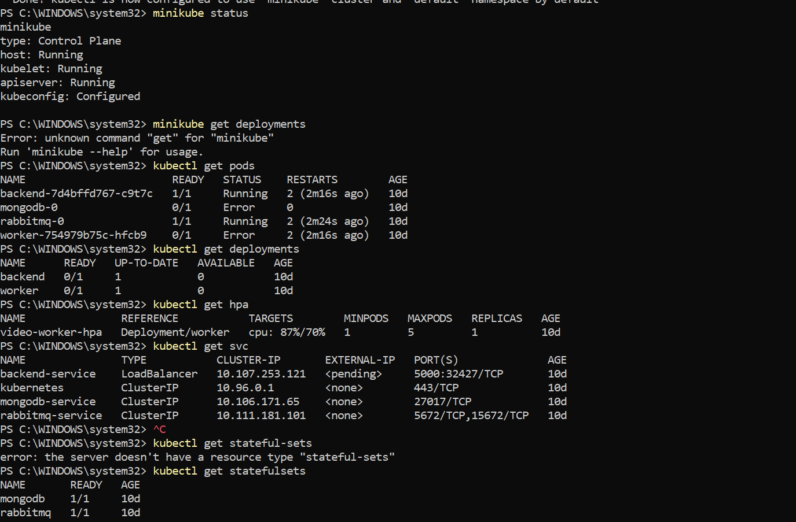
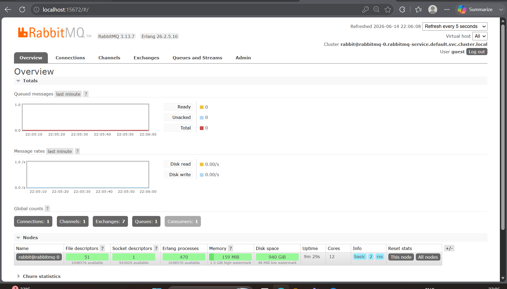
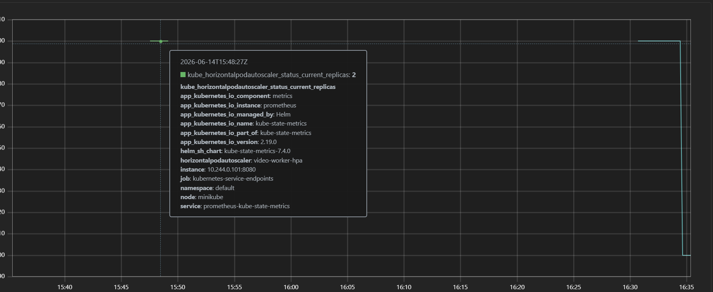
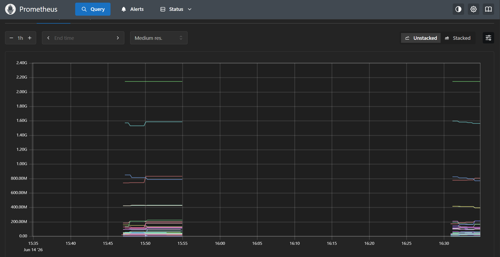
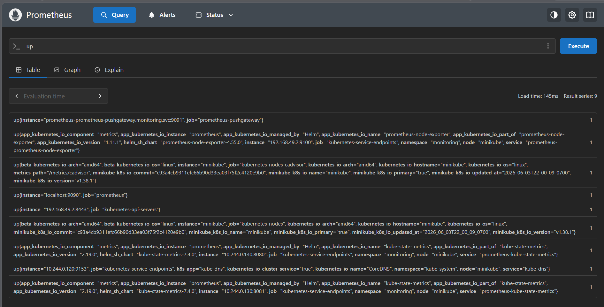
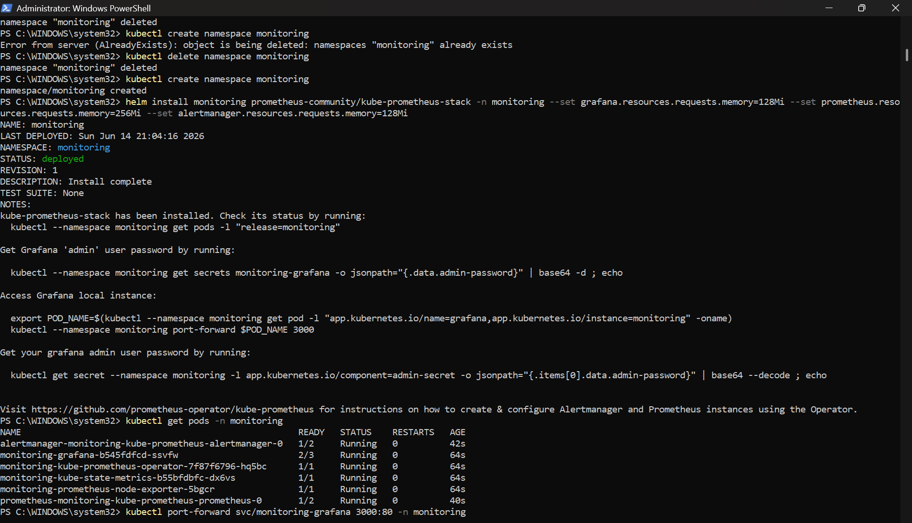

# KubeVideoFlow

A cloud-native video processing platform built using Node.js, RabbitMQ, MongoDB, Docker, Kubernetes, and FFmpeg.

Users upload videos through a web interface, and the platform asynchronously processes and compresses them using a scalable microservices architecture.

---

# ✨ Features

* Upload videos through a web interface
* Asynchronous video processing
* FFmpeg-powered video compression
* RabbitMQ message queue
* MongoDB metadata storage
* Dockerized microservices
* Kubernetes orchestration
* Horizontal Pod Autoscaling (HPA)
* ConfigMaps for configuration management
* Health Checks (Liveness & Readiness Probes)
* Prometheus Monitoring

---

# 🏗️ System Architecture


### Processing Flow

```text
User
 │
 ▼
Frontend
 │
 ▼
Backend Service
 │
 ▼
RabbitMQ Queue
 │
 ▼
Worker Service
 │
 ▼
MongoDB
```

### Monitoring

```text
Prometheus
```

### Future Scope

```text
Grafana
KEDA
GitHub Actions CI/CD
Cloud Deployment
```

---

# 📸 Screenshots

## Application UI



## Video Upload



## Processing Status



## Kubernetes Pods



## HPA



## Prometheus Monitoring



---

# 🎯 Why This Project?

Traditional video processing applications perform all operations inside a single backend service.

This project adopts a microservices architecture where:

* Backend handles requests.
* RabbitMQ handles communication.
* Worker performs CPU-intensive video processing.

This design improves:

* Scalability
* Reliability
* Maintainability
* Fault Isolation

---

# 🔍 Microservices

## Backend Service

Responsibilities:

* Receive video uploads
* Store metadata
* Push jobs into RabbitMQ
* Provide status APIs
* Return processed video information

### Technologies

* Node.js
* Express.js
* MongoDB
* RabbitMQ
* Multer

---

## Worker Service

Responsibilities:

* Consume jobs from RabbitMQ
* Execute FFmpeg commands
* Process videos
* Update MongoDB status

### Technologies

* Node.js
* RabbitMQ
* FFmpeg
* MongoDB

---

# ⚙️ Design Decisions & Trade-offs

## Why RabbitMQ?

Instead of processing videos directly inside the backend:

### Traditional Approach

```text
User
 ↓
Backend
 ↓
FFmpeg
```

Problems:

* Blocks API requests
* Difficult to scale
* High CPU usage

### Selected Approach

```text
User
 ↓
Backend
 ↓
RabbitMQ
 ↓
Worker
```

Benefits:

* Asynchronous processing
* Better scalability
* Decoupled architecture
* Improved reliability

---

## Why MongoDB?

Chosen because:

* Flexible schema
* Easy integration with Node.js
* Fast development
* Suitable for metadata storage

Trade-off:

* Not ideal for complex relational data

---

## Why Kubernetes?

Chosen because:

* Automated deployment
* Self-healing containers
* Service discovery
* Autoscaling support

Trade-off:

* More operational complexity than Docker Compose

---

## Why HPA?

Current implementation uses:

```text
CPU Based Autoscaling
```

Benefits:

* Simple
* Native Kubernetes support

Future improvement:

```text
KEDA
```

which scales based on RabbitMQ queue length instead of CPU utilization.

---

# 📂 Project Structure

```text
videoflow/
│
├── backend/
├── worker/
├── frontend/
├── kubernetes/
│   ├── backend-deployment.yaml
│   ├── worker-deployment.yaml
│   ├── mongodb-statefulset.yaml
│   ├── rabbitmq-statefulset.yaml
│   ├── worker-hpa.yaml
│   ├── configmap.yaml
│
├── screenshots/
├── architecture/
├── docker-compose.yml
└── README.md
```

---

# 🐳 Running Locally with Docker Compose

## Clone Repository

```bash
git clone https://github.com/<your-username>/VideoFlow.git
cd VideoFlow
```

## Start Services

```bash
docker-compose up --build
```

Services Started:

* MongoDB
* RabbitMQ
* Backend
* Worker

---

# ☸️ Deploying on Kubernetes

## Start Minikube

```bash
minikube start
```

## Apply Kubernetes Manifests

```bash
kubectl apply -f kubernetes/
```

Verify:

```bash
kubectl get pods
kubectl get svc
```

---

## Access Backend

```bash
kubectl port-forward deployment/backend 5000:5000
```

Backend available at:

```text
http://localhost:5000
```

---

# 📊 Monitoring

## Prometheus

Prometheus collects:

* CPU Usage
* Memory Usage
* Pod Health
* Container Metrics

Access:

```bash
kubectl port-forward svc/prometheus-server 9090:80 -n monitoring
```

Open:

```text
http://localhost:9090
```

---

# 🚀 Future Enhancements

* Grafana Dashboards
* KEDA Event Driven Autoscaling
* GitHub Actions CI/CD
* Cloud Deployment (AWS/GCP/Azure)
* Object Storage Integration (S3/MinIO)
* Multi-resolution Video Processing

---

# 🎓 Key Learning Outcomes

This project demonstrates practical experience with:

* Microservices Architecture
* Node.js Backend Development
* RabbitMQ Messaging
* MongoDB Database Management
* Docker Containerization
* Kubernetes Orchestration
* StatefulSets
* Deployments
* ConfigMaps
* Health Checks
* Horizontal Pod Autoscaling
* Prometheus Monitoring
* Distributed Systems
* Cloud Native Design

---

# 🤝 Contributing

Contributions are welcome.

If you have ideas for:

* Performance improvements
* New features
* Better observability
* CI/CD automation
* Cloud deployment

Feel free to open an Issue or Submit a Pull Request.

---

# ⭐ Support

If you found this project useful:

⭐ Star the repository

🍴 Fork the repository

🛠️ Contribute improvements

Your support helps improve the project and motivates future development.

---

Built with ❤️ using Node.js, RabbitMQ, MongoDB, Docker, Kubernetes and FFmpeg.
